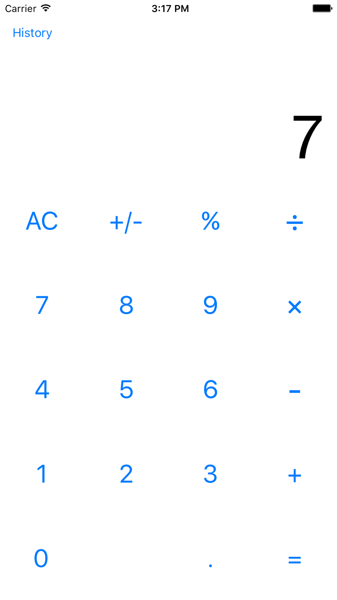

# iOS Calculator Clone
An iOS Calculator Clone for the challenge for Zappos Family 2016 summer internship program

##Functionality implemented
- Perform basic integer operations(add, subtract, multiply, divide)
- Perform basic double operations(add, subtract, multiply, divide)
- User can delete a digit by swiping right
- Support a long sequence of operations without violating order of operation
- Calculation history is recorded

##Screenshots

